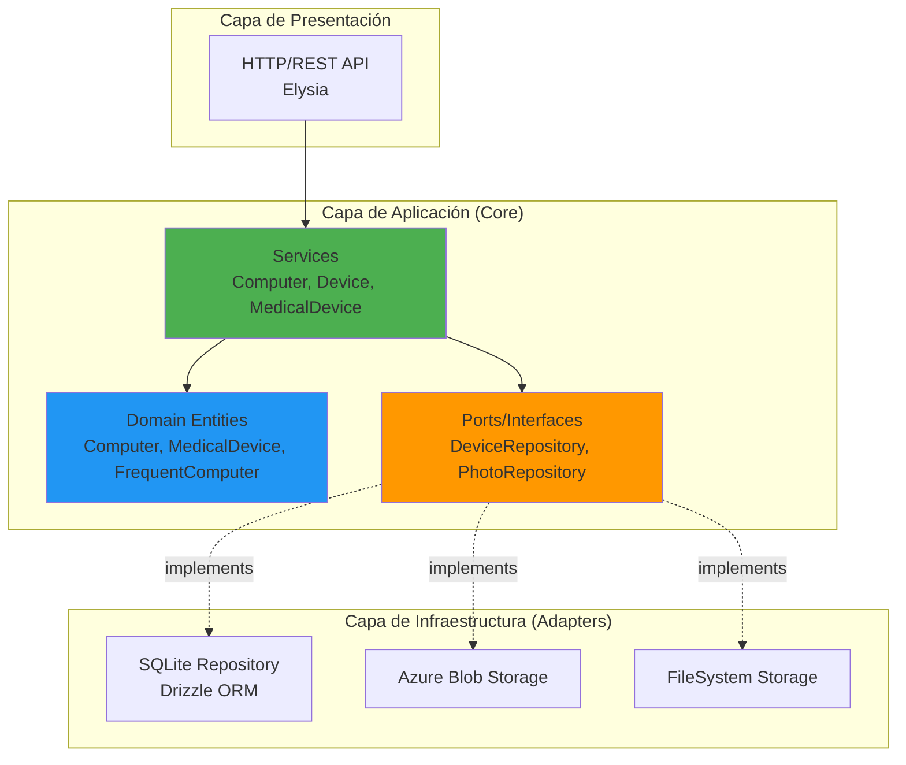
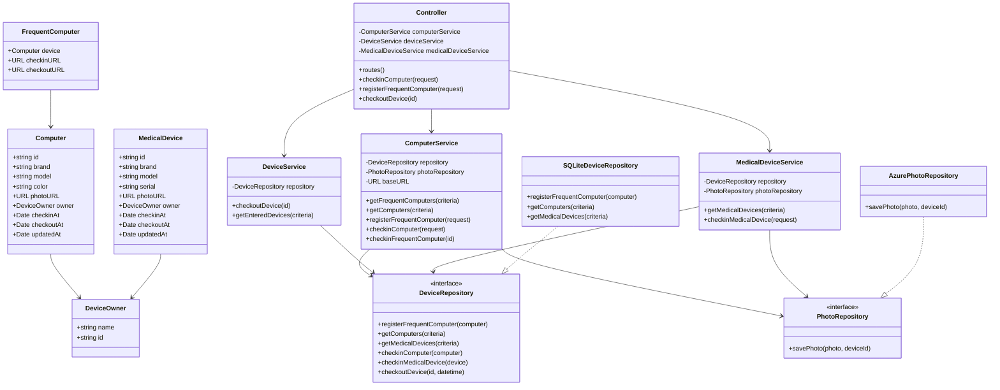
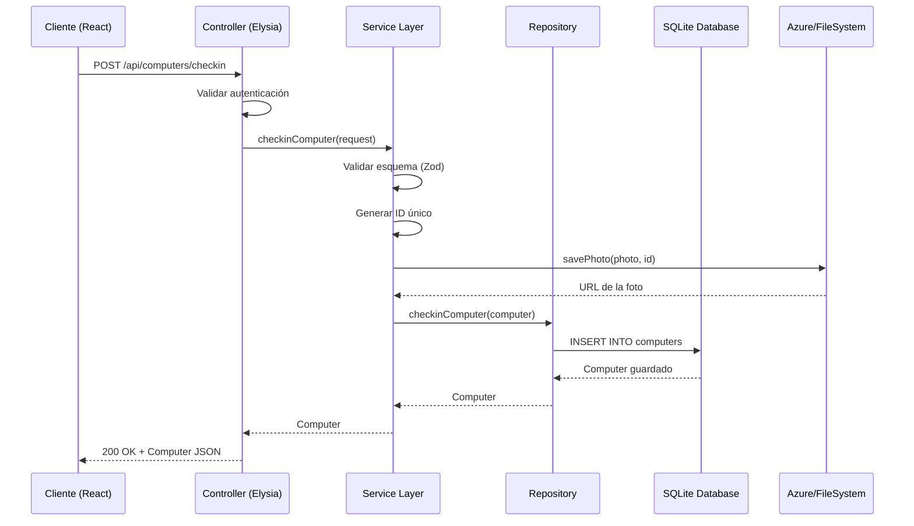

# 🏥 Sistema de Gestión de Dispositivos Hospitalarios

## 📍 URL de la Aplicación

**Frontend**: [http://localhost:5173](http://localhost:5173)  
**Backend API**: [http://localhost:3000](http://localhost:3000)  
**Documentación API**: [http://localhost:3000/swagger](http://localhost:3000/swagger)

> **Nota**: El proyecto está configurado para desarrollo local. Para despliegue en Azure, actualizar las URLs en las variables de entorno.

---

## 📖 Descripción del Proyecto

Este proyecto es un **sistema integral de gestión de dispositivos hospitalarios** que permite el registro, seguimiento y control de computadoras y equipos médicos en un entorno hospitalario. El sistema facilita el check-in y check-out de dispositivos, genera códigos QR para dispositivos frecuentes, y mantiene un historial completo de movimientos. Implementa autenticación segura mediante Better Auth y almacenamiento de fotos en Azure Blob Storage.

### 🛠️ Tecnologías y Librerías Utilizadas

#### Backend
- **[Bun](https://bun.sh/)** v1.2.22 - Runtime JavaScript ultrarrápido
- **[Elysia](https://elysiajs.com/)** - Framework web minimalista y de alto rendimiento
- **[TypeScript](https://www.typescriptlang.org/)** - Tipado estático para JavaScript
- **[Better Auth](https://www.better-auth.com/)** v1.3.13 - Sistema de autenticación moderno
- **[Drizzle ORM](https://orm.drizzle.team/)** v0.44.5 - ORM TypeScript-first
- **[SQLite](https://www.sqlite.org/)** - Base de datos embebida
- **[Zod](https://zod.dev/)** v4.1.11 - Validación de esquemas TypeScript
- **[Azure Blob Storage](https://azure.microsoft.com/en-us/products/storage/blobs)** v12.28.0 - Almacenamiento de fotos
- **[QRCode](https://www.npmjs.com/package/qrcode)** v1.5.4 - Generación de códigos QR
- **[@elysiajs/cors](https://elysiajs.com/plugins/cors.html)** v1.4.0 - Manejo de CORS
- **[@elysiajs/openapi](https://elysiajs.com/plugins/swagger.html)** v1.4.10 - Documentación OpenAPI/Swagger

#### Frontend
- **[React](https://react.dev/)** v18.3.1 - Biblioteca para interfaces de usuario
- **[Vite](https://vitejs.dev/)** v6.0.1 - Build tool y dev server
- **[React Router DOM](https://reactrouter.com/)** v7.1.1 - Enrutamiento
- **[Better Auth React](https://www.better-auth.com/)** v1.3.13 - Cliente de autenticación

#### Testing
- **[Bun Test](https://bun.sh/docs/cli/test)** - Framework de testing integrado
- **30 pruebas unitarias** con 100% de éxito

---

## 📁 Estructura del Proyecto

```
ProyectoDJ/
├── Back/                           # Backend (API REST)
│   ├── src/
│   │   ├── adapter/               # Capa de adaptadores (Hexagonal Architecture)
│   │   │   ├── api/              # Adaptadores de API
│   │   │   │   └── elysia/       # Implementación con Elysia
│   │   │   │       ├── controller.elysia.ts    # Controladores HTTP
│   │   │   │       ├── elysia.api.ts          # Configuración de Elysia
│   │   │   │       ├── criteria.helper.ts     # Helpers para queries
│   │   │   │       └── index.ts
│   │   │   ├── photo/            # Adaptadores de almacenamiento de fotos
│   │   │   │   ├── azure/        # Implementación Azure Blob Storage
│   │   │   │   └── filesystem/   # Implementación sistema de archivos
│   │   │   └── repository/       # Adaptadores de persistencia
│   │   │       └── sql/          # Implementación SQLite con Drizzle
│   │   │
│   │   ├── core/                 # Lógica de negocio (Domain-Driven Design)
│   │   │   ├── auth/            # Configuración de autenticación
│   │   │   ├── domain/          # Entidades de dominio
│   │   │   │   ├── computer.domain.ts
│   │   │   │   ├── medical-device.domain.ts
│   │   │   │   ├── shared.domain.ts
│   │   │   │   ├── criteria.domain.ts
│   │   │   │   └── device-history.domain.ts
│   │   │   ├── dto/             # Data Transfer Objects
│   │   │   │   ├── computer-request.dto.ts
│   │   │   │   └── medical-device-request.dto.ts
│   │   │   ├── repository/      # Interfaces de repositorios
│   │   │   │   ├── device.repository.ts
│   │   │   │   └── photo.repository.ts
│   │   │   ├── service/         # Servicios de aplicación
│   │   │   │   ├── computer.service.ts
│   │   │   │   ├── device.service.ts
│   │   │   │   ├── medical-device.service.ts
│   │   │   │   ├── device-history.service.ts
│   │   │   │   ├── qr.service.ts
│   │   │   │   ├── helper.ts
│   │   │   │   └── error.ts
│   │   │   └── utils/           # Utilidades
│   │   │       └── validation-schemas.ts
│   │   │
│   │   ├── __mocks__/           # Mocks para testing
│   │   │   ├── test-helpers.ts
│   │   │   ├── repository.mock.ts
│   │   │   └── photo-repository.mock.ts
│   │   │
│   │   ├── index.ts             # Punto de entrada de la aplicación
│   │   └── index.test.ts        # Tests de integración
│   │
│   ├── public/                  # Archivos públicos
│   ├── database.SQLite          # Base de datos SQLite
│   ├── package.json             # Dependencias del proyecto
│   ├── tsconfig.json            # Configuración TypeScript
│   ├── .env                     # Variables de entorno
│   └── TESTS_README.md          # Documentación de pruebas
│
└── Front/                       # Frontend (React SPA)
    └── device-frontend/
        ├── src/
        │   ├── components/      # Componentes React
        │   │   ├── Login.jsx
        │   │   ├── Register.jsx
        │   │   ├── Dashboard.jsx
        │   │   ├── ComputerForm.jsx
        │   │   ├── MedicalDeviceForm.jsx
        │   │   └── DeviceList.jsx
        │   ├── App.jsx          # Componente principal
        │   ├── App.css          # Estilos globales
        │   └── main.jsx         # Punto de entrada
        ├── public/              # Assets estáticos
        ├── package.json
        └── vite.config.js
```

---

## 📂 Explicación de las Carpetas

### Backend

#### `adapter/`
Implementa el patrón **Hexagonal Architecture** (Ports & Adapters). Contiene las implementaciones concretas de las interfaces definidas en el core. Esta capa se comunica con el mundo exterior (HTTP, base de datos, almacenamiento).

- **`api/elysia/`**: Adaptador HTTP usando Elysia framework
  - `controller.elysia.ts`: Define todos los endpoints REST y sus handlers
  - `elysia.api.ts`: Configura el servidor Elysia con CORS, OpenAPI y middleware
  - `criteria.helper.ts`: Parsea query parameters para filtros y paginación

- **`photo/`**: Adaptadores para almacenamiento de fotos
  - `azure/`: Implementación con Azure Blob Storage (producción)
  - `filesystem/`: Implementación con sistema de archivos local (desarrollo)

- **`repository/sql/`**: Implementación de repositorios con SQLite y Drizzle ORM
  - Define esquemas de base de datos
  - Implementa operaciones CRUD
  - Maneja migraciones

#### `core/`
Contiene la **lógica de negocio pura**, independiente de frameworks. Implementa principios de **Domain-Driven Design (DDD)**.

- **`auth/`**: Configuración de Better Auth
  - Define estrategias de autenticación
  - Configura middleware de protección de rutas

- **`domain/`**: Entidades del dominio
  - `Computer`: Computadoras regulares
  - `FrequentComputer`: Computadoras con acceso frecuente (con QR)
  - `MedicalDevice`: Dispositivos médicos
  - `EnteredDevice`: Vista unificada de dispositivos ingresados
  - `DeviceHistory`: Historial de movimientos

- **`dto/`**: Data Transfer Objects
  - Define estructuras de datos para requests
  - Incluye esquemas de validación Zod
  - Funciones de mapeo entre DTOs y entidades

- **`repository/`**: Interfaces (Ports)
  - `DeviceRepository`: Operaciones de persistencia de dispositivos
  - `DevicePhotoRepository`: Operaciones de almacenamiento de fotos

- **`service/`**: Servicios de aplicación (casos de uso)
  - `ComputerService`: Gestión de computadoras y frecuentes
  - `DeviceService`: Check-out y listado de dispositivos
  - `MedicalDeviceService`: Gestión de dispositivos médicos
  - `DeviceHistoryService`: Consulta de historial
  - `QRService`: Generación de códigos QR
  - `Helper`: Funciones auxiliares (generación de IDs, URLs)

- **`utils/`**: Utilidades compartidas
  - Esquemas de validación reutilizables

#### `__mocks__/`
Contiene mocks para pruebas unitarias. Permite aislar la lógica de negocio de dependencias externas.

### Frontend

#### `components/`
Componentes React organizados por funcionalidad:
- **`Login.jsx`**: Formulario de inicio de sesión
- **`Register.jsx`**: Formulario de registro de usuarios
- **`Dashboard.jsx`**: Panel principal con navegación
- **`ComputerForm.jsx`**: Formulario para registrar computadoras
- **`MedicalDeviceForm.jsx`**: Formulario para dispositivos médicos
- **`DeviceList.jsx`**: Lista y gestión de dispositivos

---

## ⚙️ Configuración y Entorno

### Variables de Entorno (`.env`)

```env
# Autenticación
BETTER_AUTH_SECRET=LbagX2VEDutEpP1W8XTrculsiW12OT8n
BETTER_AUTH_URL=http://localhost:3000

# Base de Datos
DB_FILE_NAME=database.SQLite

# Azure Blob Storage (Producción)
AZURE_STORAGE_ACCOUNT=your_storage_account_name
AZURE_STORAGE_KEY=your_storage_account_key_here
AZURE_CONTAINER_NAME=device-photos
```

### Configuración de Base de Datos

- **Motor**: SQLite 3
- **Archivo**: `database.SQLite` (raíz del proyecto Back)
- **ORM**: Drizzle ORM
- **Migraciones**: Automáticas al iniciar la aplicación

**Tablas principales**:
- `computers`: Computadoras regulares
- `frequent_computers`: Computadoras con acceso frecuente
- `medical_devices`: Dispositivos médicos
- `users`: Usuarios del sistema (Better Auth)
- `sessions`: Sesiones activas (Better Auth)

### Configuración de CORS

El backend acepta peticiones desde:
- **Frontend local**: `http://localhost:5173`
- **Métodos permitidos**: GET, POST, PUT, PATCH, DELETE, OPTIONS
- **Credenciales**: Habilitadas (cookies)

---

## 🚀 Cómo Ejecutar el Proyecto

### Prerrequisitos

- **[Bun](https://bun.sh/)** v1.2+ instalado
- **[Node.js](https://nodejs.org/)** v18+ (para el frontend)
- **Git** para clonar el repositorio

### Instalación y Ejecución

#### 1. Clonar el Repositorio

```bash
git clone <URL_DEL_REPOSITORIO>
cd ProyectoDJ
```

#### 2. Configurar el Backend

```bash
cd Back

# Instalar dependencias
bun install

# Copiar archivo de variables de entorno
cp .env.example .env

# Editar .env con tus credenciales de Azure (opcional para desarrollo)
# Para desarrollo local, el sistema usará FileSystemPhotoRepository
```

#### 3. Iniciar el Backend

```bash
# Modo desarrollo (con hot reload)
bun run dev

# El servidor iniciará en http://localhost:3000
# La documentación Swagger estará en http://localhost:3000/swagger
```

> ✅ **Verificación**: Visita `http://localhost:3000` - deberías ver "Servidor funcionando correctamente 🚀"

#### 4. Configurar el Frontend

```bash
# En una nueva terminal
cd Front/device-frontend

# Instalar dependencias
npm install
```

#### 5. Iniciar el Frontend

```bash
npm run dev

# El frontend iniciará en http://localhost:5173
```

#### 6. Acceder a la Aplicación

1. Abre tu navegador en `http://localhost:5173`
2. Regístrate con un nuevo usuario
3. Inicia sesión
4. ¡Comienza a gestionar dispositivos!

### Ejecutar Pruebas

```bash
cd Back

# Ejecutar todas las pruebas
bun test

# Ejecutar solo pruebas unitarias
bun run test:unit

# Ejecutar en modo watch
bun run test:watch
```

**Resultado esperado**: ✅ 30 pruebas pasando

---

## 🌐 Endpoints Disponibles

### Autenticación

| Endpoint | Método | Descripción | Autenticación |
|----------|--------|-------------|---------------|
| `/api/auth/sign-up` | POST | Registrar nuevo usuario | No |
| `/api/auth/sign-in` | POST | Iniciar sesión | No |
| `/api/auth/sign-out` | POST | Cerrar sesión | Sí |
| `/api/auth/session` | GET | Obtener sesión actual | Sí |

### Computadoras

| Endpoint | Método | Descripción | Autenticación |
|----------|--------|-------------|---------------|
| `/api/computers` | GET | Listar computadoras | Sí |
| `/api/computers/checkin` | POST | Registrar ingreso de computadora | Sí |
| `/api/computers/frequent` | GET | Listar computadoras frecuentes | Sí |
| `/api/computers/frequent` | POST | Registrar computadora frecuente | Sí |
| `/api/computers/frequent/checkin/:id` | PATCH | Check-in de computadora frecuente | Sí |
| `/api/computers/frequent/:id/qrcodes` | GET | Obtener códigos QR | Sí |

### Dispositivos Médicos

| Endpoint | Método | Descripción | Autenticación |
|----------|--------|-------------|---------------|
| `/api/medicaldevices` | GET | Listar dispositivos médicos | Sí |
| `/api/medicaldevices/checkin` | POST | Registrar ingreso de dispositivo | Sí |

### Dispositivos Generales

| Endpoint | Método | Descripción | Autenticación |
|----------|--------|-------------|---------------|
| `/api/devices/entered` | GET | Listar todos los dispositivos ingresados | Sí |
| `/api/devices/checkout/:id` | PATCH | Registrar salida de dispositivo | Sí |
| `/api/devices/history` | GET | Obtener historial de movimientos | Sí |

### Query Parameters (Filtros)

Todos los endpoints GET aceptan los siguientes parámetros opcionales:

- `limit`: Número máximo de resultados (default: sin límite)
- `offset`: Número de resultados a saltar (paginación)

**Ejemplo**:
```
GET /api/computers?limit=10&offset=0
```

---

## 🏗️ Arquitectura del Proyecto

### Patrón Arquitectónico: Hexagonal Architecture (Ports & Adapters)



### Diagrama de Clases (UML)



### Flujo de Datos



---

## 🎯 Características Principales

### ✅ Funcionalidades Implementadas

1. **Autenticación y Autorización**
   - Registro e inicio de sesión seguro
   - Protección de rutas con middleware
   - Gestión de sesiones con cookies

2. **Gestión de Computadoras**
   - Check-in/check-out de computadoras regulares
   - Registro de computadoras frecuentes con códigos QR
   - Generación automática de URLs para acceso rápido

3. **Gestión de Dispositivos Médicos**
   - Registro con número de serie obligatorio
   - Almacenamiento de fotos
   - Seguimiento de propietarios

4. **Almacenamiento de Fotos**
   - Azure Blob Storage (producción)
   - Sistema de archivos local (desarrollo)
   - URLs públicas accesibles

5. **Historial de Dispositivos**
   - Registro completo de movimientos
   - Filtrado y paginación
   - Ordenamiento por fecha

6. **Códigos QR**
   - Generación automática para dispositivos frecuentes
   - QR de check-in y check-out separados
   - Formato base64 para fácil integración

### 🧪 Testing

- **30 pruebas unitarias** con 100% de éxito
- Cobertura de todos los servicios principales
- Mocks para aislamiento de dependencias
- Ejecución rápida (~165ms)

---

## 📚 Documentación Adicional

- **[TESTS_README.md](Back/TESTS_README.md)**: Documentación completa de pruebas unitarias
- **[AUTH_IMPLEMENTATION.md](AUTH_IMPLEMENTATION.md)**: Guía de implementación de autenticación
- **Swagger UI**: Disponible en `http://localhost:3000/swagger` cuando el servidor está corriendo

---

## 👥 Autores

**Grupo PDS006 - San Rafael**

---

## 📄 Licencia

Este proyecto es parte de un trabajo académico para el curso de Frameworks de Desarrollo.

---

## 🔧 Solución de Problemas

### El backend no inicia

- Verifica que Bun esté instalado: `bun --version`
- Asegúrate de estar en la carpeta `Back`
- Revisa que el puerto 3000 no esté en uso

### Error de CORS en el frontend

- Verifica que el backend esté corriendo en `http://localhost:3000`
- Confirma que el frontend esté en `http://localhost:5173`
- Revisa la configuración de CORS en `elysia.api.ts`

### Las fotos no se guardan

- En desarrollo, las fotos se guardan en `Back/public/photos/`
- Para producción, configura las credenciales de Azure en `.env`
- Verifica permisos de escritura en la carpeta `public`

### Problemas con la base de datos

- Elimina `database.SQLite` y reinicia el servidor para recrearla
- Verifica que no haya procesos bloqueando el archivo
- Revisa los logs del servidor para errores específicos

---

**¡Gracias por usar nuestro Sistema de Gestión de Dispositivos Hospitalarios!** 🏥✨
